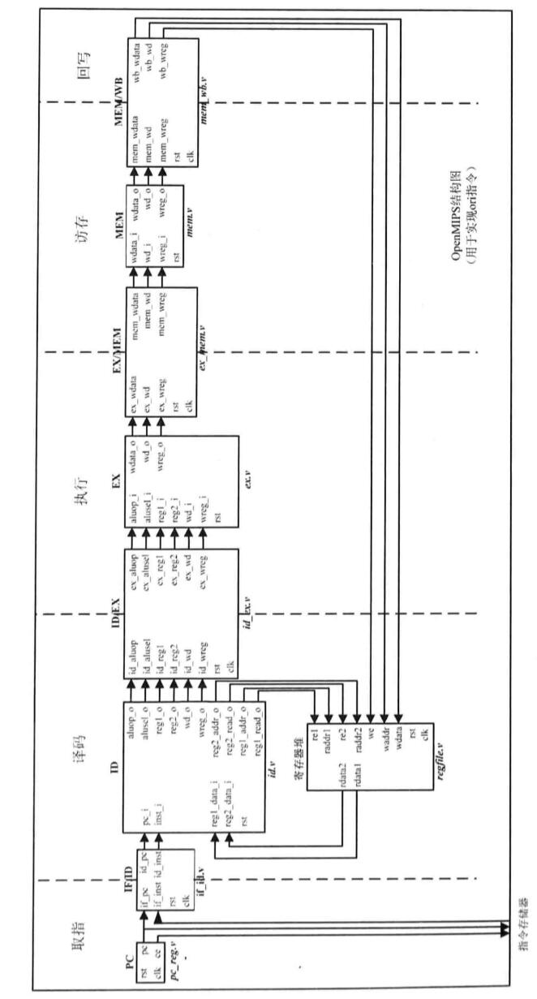
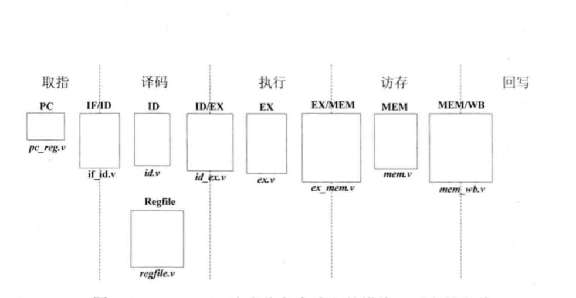
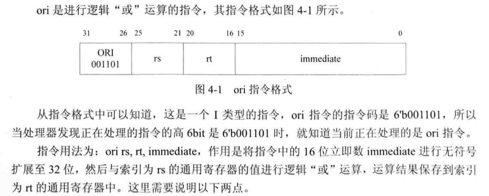

# 简易五级流水线mips

主要参考了《自己动手写cpu》作者：雷思磊

最终上交的代码实现了多余要求的指令，由于不是项目要求的，所以我不会在文档中过多描述。

文档主要讲述的是关于项目需求的设计，除此之外的部件不会过多说明。

文档的思路是项目框架的建立和改进，事实上在框架之下每个指令的完成并不会需要很大的工作量，所以可能只会解释一些指令实现的例子，主要还是集中在流水线的设计上。

五级流水线主要分为取指，译码，执行，访存，写回

1. Instruction Fetch - IF：取指阶段；
2. Instruction Decode - ID：译码阶段；
3. Execute - EX：执行阶段；
4. Memory Access - MEM：访存阶段；
5. Writeback - WB：写回阶段。

## 主要结构

主要结构我参考了下面两张图，虽然随着功能的增加，这两张图展现的信息可能不足以完整的概括整个架构，但我认为它们足够说明设计思路。

这张图展示了大致的数据走线。



这张图展示了程序的架构，每个文件在五级流水线中担任的任务。



## 主要部件

### PC模块

| 序号 | 接口 | 宽度 | in/out | 作用               |
| :--- | :--- | :--- | :----- | :----------------- |
| 1    | rst  | 1    | in     | 复位信号           |
| 2    | clk  | 1    | in     | 时钟信号           |
| 3    | pc   | 32   | out    | 要读取指令的地址   |
| 4    | ce   | 1    | out    | 指令寄存器使能信号 |

### IF/ID模块

IF/ID模块的作用是暂时保存取指阶段所得的指令，以及对应的指令地址，并在下一个CLK传递到译码阶段。

| 序号 | 接口    | 宽度 | in/out | 作用                     |
| :--- | :------ | :--- | :----- | :----------------------- |
| 1    | rst     | 1    | in     | 复位信号                 |
| 2    | clk     | 1    | in     | 时钟信号                 |
| 3    | if_pc   | 32   | in     | 取址阶段得到的指令的地址 |
| 4    | if_inst | 32   | in     | 取址阶段得到的指令       |
| 5    | id_pc   | 32   | out    | 译码阶段的指令的地址     |
| 6    | id_inst | 32   | out    | 译码阶段的指令           |

### RegFile模块

这是寄存器堆模块，实现了32个32位通用寄存器，可以同时进行两个寄存器的读操作和一个寄存器的写操作。

| 序号 | 接口   | 宽度 | in/out | 作用                     |
| :--- | :----- | :--- | :----- | :----------------------- |
| 1    | rst    | 1    | in     | 复位信号                 |
| 2    | clk    | 1    | in     | 时钟信号                 |
| 3    | waddr  | 5    | in     | 写入的寄存器地址         |
| 4    | wdata  | 32   | in     | 写入的寄存器的数据       |
| 5    | we     | 1    | in     | 写使能                   |
| 6    | raddr1 | 5    | in     | 第一个读端口的寄存器地址 |
| 7    | re1    | 1    | in     | 第一个读端口的使能信号   |
| 8    | rdata1 | 32   | out    | 第一个读端口的输出数据   |
| 9    | raddr2 | 5    | in     | 第二个读端口的寄存器地址 |
| 10   | re2    | 1    | in     | 第二个读端口的使能信号   |
| 11   | rdata2 | 32   | out    | 第二个读端口的输出数据   |

### ID模块

ID模块进行译码，得到最终运算的类型、子类型、源操作数、目的寄存器地址等等

| 序号 | 接口        | 宽度 | in/out | 作用                              |
| :--- | :---------- | :--- | :----- | :-------------------------------- |
| 1    | rst         | 1    | in     | 复位信号                          |
| 2    | pc_i        | 32   | in     | 译码阶段指令地址                  |
| 3    | inst_i      | 32   | in     | 译码阶段的指令                    |
| 4    | ex_wd_i     | 5    | in     | 来自ex阶段要写入的寄存器地址      |
| 5    | ex_wreg_i   | 1    | in     | 来自ex阶段是否要写入寄存器        |
| 6    | ex_wdata_i  | 32   | in     | 来自ex阶段要写入寄存器的值        |
| 7    | mem_wd_i    | 5    | out    | 来自mem阶段要写入的寄存器地址     |
| 8    | mem_wreg_i  | 1    | out    | 来自mem阶段是否要写入寄存器       |
| 9    | mem_wdata_i | 32   | out    | 来自mem阶段要写入寄存器的值       |
| 10   | reg1_data_i | 32   | in     | 从regfile输入的第一个读端口的输入 |
| 11   | reg2_data_i | 32   | in     | 从regfile输入的第二个读端口的输入 |
| 12   | reg1_read_o | 1    | out    | regfile第一个读端口的使能         |
| 13   | reg2_read_o | 1    | out    | regfile第二个读端口的使能         |
| 14   | reg1_addr_o | 5    | out    | regfile第一个读端口的地址         |
| 15   | reg2_addr_o | 5    | out    | regfile第二个读端口的地址         |
| 16   | aluop_o     | 8    | out    | 运算的子类型                      |
| 17   | alusel_o    | 3    | out    | 运算的类型                        |
| 18   | reg1_o      | 32   | out    | 源操作数1                         |
| 19   | reg2_o      | 32   | out    | 源操作数2                         |
| 20   | wd_o        | 5    | out    | 指令要写入的目的寄存器地址        |
| 21   | wreg_o      | 1    | out    | 指令是否要写入寄存器              |

### ID/EX模块

ID模块的输出连接到ID/EX模块，后者将译码阶段取得的运算类型、源操作数、要写的目的寄存器地址等结果，在下一个时钟传递到执行阶段。

| 序号 | 接口      | 宽度 | in/out | 作用                           |
| :--- | :-------- | :--- | :----- | :----------------------------- |
| 1    | rst       | 1    | in     | 复位信号                       |
| 2    | clk       | 1    | in     | 时钟信号                       |
| 3    | id_alusel | 3    | in     | id阶段指令的计算类型           |
| 4    | id_aluop  | 8    | in     | id阶段指令的计算子类型         |
| 5    | id_reg1   | 32   | in     | id阶段指令的源操作数1          |
| 6    | id_reg2   | 32   | in     | id阶段指令的源操作数2          |
| 7    | id_wd     | 5    | in     | id阶段指令要写入的寄存器的地址 |
| 8    | id_wreg   | 1    | in     | id阶段指令是否要写入的寄存器   |
| 9    | ex_alusel | 3    | out    | ex阶段指令的计算类型           |
| 10   | ex_aluop  | 8    | out    | ex阶段指令的计算子类型         |
| 11   | ex_reg1   | 32   | out    | ex阶段指令的源操作数1          |
| 12   | ex_reg2   | 32   | out    | ex阶段指令的源操作数2          |
| 13   | ex_wd     | 5    | out    | ex阶段指令要写入的寄存器的地址 |
| 14   | ex_reg    | 1    | out    | ex阶段指令是否要写入的寄存器   |

### EX模块

EX模块接收ID阶段翻译的信号来决定如何进行操作。

| 序号 | 接口     | 宽度 | in/out | 作用                           |
| :--- | :------- | :--- | :----- | :----------------------------- |
| 1    | rst      | 1    | in     | 复位信号                       |
| 2    | alusel_i | 3    | in     | ex阶段指令的运算类型           |
| 3    | aluop_i  | 8    | in     | ex阶段指令的运算子类型         |
| 4    | reg1_i   | 32   | in     | ex阶段指令的源操作数1          |
| 5    | reg2_i   | 32   | in     | ex阶段指令的源操作数2          |
| 6    | wd_i     | 5    | in     | ex阶段指令要写入的寄存器的地址 |
| 7    | wreg_i   | 1    | in     | ex阶段指令是否要写入的寄存器   |
| 8    | wd_o     | 5    | out    | 最终要写入的寄存器地址         |
| 9    | wreg_o   | 1    | out    | 最终是否要写入寄存器           |
| 10   | wdata_o  | 32   | out    | 最终要写入寄存器的值           |


### EX/MEM模块

EX模块的输出连接到EX/MEM模块，后者的作用是将执行阶段的结果在下一个时钟周期传递到访存阶段。

| 序号 | 接口      | 宽度 | in/out | 作用                     |
| :--- | :-------- | :--- | :----- | :----------------------- |
| 1    | rst       | 1    | in     | 复位信号                 |
| 2    | clk       | 1    | in     | 时钟信号                 |
| 3    | ex_wd     | 5    | in     | ex最终要写入的寄存器地址 |
| 4    | ex_wreg   | 1    | in     | ex最终是否要写入寄存器   |
| 5    | ex_wdata  | 32   | in     | ex最终要写入寄存器的值   |
| 6    | mem_wd    | 5    | out    | mem要写入的寄存器地址    |
| 7    | mem_wreg  | 1    | out    | mem是否要写入寄存器      |
| 8    | mem_wdata | 32   | out    | mem要写入寄存器的值      |


### MEM模块

| 序号 | 接口    | 宽度 | in/out | 作用                          |
| :--- | :------ | :--- | :----- | :---------------------------- |
| 1    | rst     | 1    | in     | 复位信号                      |
| 2    | wd_i    | 5    | in     | mem阶段要写入的寄存器地址     |
| 3    | wreg_i  | 1    | in     | mem阶段是否要写入寄存器       |
| 4    | wdata_i | 32   | in     | mem阶段要写入寄存器的值       |
| 5    | wd_o    | 5    | out    | mem阶段最终要写入的寄存器地址 |
| 6    | wreg_o  | 1    | out    | mem阶段最终是否要写入寄存器   |
| 7    | wdata_o | 32   | out    | mem阶段最终要写入寄存器的值   |

### MEM/WB模块

| 序号 | 接口      | 宽度 | in/out | 作用                      |
| :--- | :-------- | :--- | :----- | :------------------------ |
| 1    | rst       | 1    | in     | 复位信号                  |
| 2    | clk       | 1    | in     | 时钟信号                  |
| 3    | mem_wd    | 5    | in     | mem最终要写入的寄存器地址 |
| 4    | mem_wreg  | 1    | in     | mem最终是否要写入寄存器   |
| 5    | mem_wdata | 32   | in     | mem最终要写入寄存器的值   |
| 6    | wb_wd     | 5    | out    | wb要写入的寄存器地址      |
| 7    | wb_wreg   | 1    | out    | wb是否要写入寄存器        |
| 8    | wb_wdata  | 32   | out    | wb要写入寄存器的值        |

### Ctrl模块

用来控制停机的模块，单独在流水线之外


### mips

最后需要做的是安装上面图片中的架构通过wire来连接所有的module就可以了

>以上的接口设计满足了add ，sub，or等算数和逻辑指令的完成

## 以ori为例子分析框架下的指令实现



pc寄存器读取到指令地址，id阶段收到指令后开始解析，通过inst[31:26]可以得知这是ori指令（指令的识别可以慢慢设计，简洁的方法区分指令码和功能码），然后进入ori指令的译码

```verilog
write_reg_enable_output <= `WriteEnable;
                    aluop_output <= `EXE_OR_OP;
                    alusel_output <= `EXE_RES_LOGIC;
                    reg1_read_output <= 1'b1;
                    reg2_read_output <= 1'b0;
                    imm <= {16'h0, instruction_input[15:0]};
                    write_reg_address_output <= instruction_input[20:16];
                    instruction_valid <= `InstructionValid;
```

设置最终写寄存器enable，aluop为or，alusel为logic，第一个regfile的读端口enable，第二个disable，imm保存立即数（注意这边做了一次无符号扩展），通过inst[20:16]获得要最终写入的寄存器的地址，最后标记为有效的指令。

在后续处理操作数输出的时候,由于第二个读取端口disable了，暗含了第二个操作数为立即数，所以把第二个操作数设置为立即数，第一个操作数就正常读取regfile即可。

```verilog
else if (reg2_read_output == 1'b0) begin
            reg2_output <= imm;
```


然后进入执行阶段,通过aluop来进入or的操作，记录为logic_res，由于alusel为logic的，最后输出的时候会选择logic_res，与此同时上一阶段的目的寄存器地址和写使能一样的传输到了当前阶段。
```verilog
case (aluop_input)
                `EXE_OR_OP: begin
                    logic_res <= reg1_input | reg2_input;
                end
                `EXE_AND_OP: begin
                    logic_res <= reg1_input & reg2_input;
                end
                `EXE_NOR_OP: begin
                    logic_res <= ~(reg1_input | reg2_input);
                end
                `EXE_XOR_OP: begin
                    logic_res <= reg1_input ^ reg2_input;
                end
                default: begin
                    logic_res <= `ZeroWord;
                end
            endcase
```

后续的访存阶段不需要处理，照常传输数据到下一个阶段，当写回阶段时就可以把计算结果写入到目的寄存器。

至此ori的实现结束了，addi，add，sub等等类似的指令的实现完全类似


## 数据冒险的解决

数据冒险一般有三种情况

1，数据处于写回阶段的时候，正在译码的指令要读取目的寄存器

解决方案是直接在regfile里加一个逻辑，当要写入的地址和读取的地址一样的时候，直接把写入的数据赋值给输出的read数据

```veerilog
else if ((read_address1 == write_address) &&
		(write_enable == `WriteEnable) &&
		(read_enable1 == `ReadEnable)) begin
		      read_data1 <= write_data;
        //数据前推，检测到读取的地址和写地址一致
```

2, 数据处于执行阶段的时候，正在译码的指令要读取目的寄存器
3, 数据处于访存阶段的时候，正在译码的指令要读取目的寄存器

依旧是数据前推来解决，在id模块添加接口

|     |             |     |     |                               |
| --- | ----------- | --- | --- | ----------------------------- |
| 4   | ex_wd_i     | 5   | in  | 来自ex阶段要写入的寄存器地址  |
| 5   | ex_wreg_i   | 1   | in  | 来自ex阶段是否要写入寄存器    |
| 6   | ex_wdata_i  | 32  | in  | 来自ex阶段要写入寄存器的值    |
| 7   | mem_wd_i    | 5   | out | 来自mem阶段要写入的寄存器地址 |
| 8   | mem_wreg_i  | 1   | out | 来自mem阶段是否要写入寄存器   |
| 9   | mem_wdata_i | 32  | out | 来自mem阶段要写入寄存器的值   |

当判断到写入的寄存器地址和当前译码的指令的要读的寄存器的地址一致的时候，直接把ex/mem阶段的data作为这边读取的数据。


## 跳转的实现

对于项目需求而言就是j指令，显然的是跳转一旦发生就会改变pc寄存器的价，但是由于是流水线设计，在发生跳转之前可能已经有指令被读入流水线并开始处理，为了尽量减少跳转带来的问题，越早跳转越好，所以直接在译码阶段实现，如果直接到了跳转就开始跳转操作。

为id和pc寄存器模块增加接口branch_flag和branch_target_address，对于id模块是输出，pc模块是输入，当译码是发现了跳转指令就设置branch_flag为1和branch_target_address为target地址，当pc下一次尝试读取指令的时候发现了1跳转的发生，就会把pc修改到branch_target_address。

这样的策略对于j指令只会导致一条错误指令的读入。直接的解决方案是当j指令在id阶段结束运行的时候，下一条错误指令进入id阶段，直接替换为nop即可。这样子代价为一个时钟周期。

## 加载存储内存

单独建立了一个data ram，允许在访存阶段根据sw和lw的op来加载或者存储数据。

```verilog
`EXE_LW_OP: begin
                    memory_address_output <= memory_address_input;
                    memory_write_enable_output <= `WriteDisable;
                    memory_chip_enable_output <= `ChipEnable;
                    write_reg_data_output <= memory_data_input;
                    memory_sel_output <= 4'b1111;
                end
```


```verilog
 `EXE_SW_OP: begin
                    memory_address_output <= memory_address_input;
                    memory_write_enable_output <= `WriteEnable;
                    memory_data_output <= reg2_input;
                    memory_sel_output <= 4'b1111;
                    memory_chip_enable_output <= `ChipEnable;
                end
```

## 测试

测试使用的是来自ppt 1 MIPS微处理器原理-微体系结构(单周期)最后的测试样例和方法，整个项目一致都没有找到什么比较方便的测试方案，单个模块的测试在流水线当中意义不大，最后通过ppt上的测试方法得到的波形图放在了提交压缩包的目录下，仅供参考。