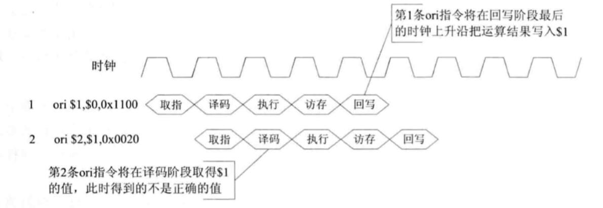
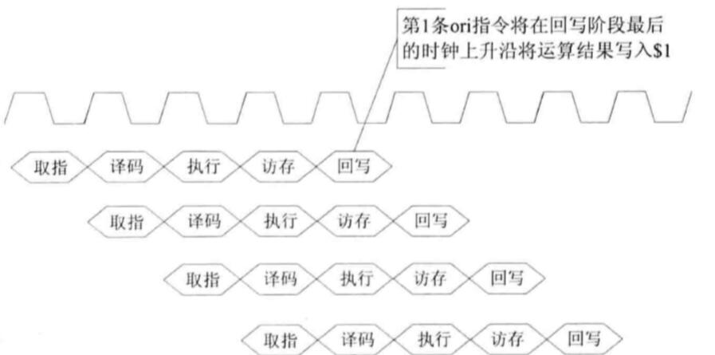

HITwh NSCSCC Team | 哈尔滨工业大学（威海）全国大学生计算机系统能力培养大赛小组

# 8-ORI 的数据相关

首先，我们对ORI指令进行分析，看看它到底属于哪一种数据相关类型、为什么属于这一种数据相关类型

## ORI的数据相关解析

比如

```
ORI $1, $0, 0x1100
ORI $2, $1, 0x0020
```



- 第一条ORI指令将运算结果写回寄存器1；
- 第二条ORI指令需要读出寄存器1的数据拿来和立即数进行运算；
- 在编程的时候，我们期望的是将第一条指令的运算结果用于第二条指令。

但是当第二条指令进行到 ID 阶段的时候：

- 第一条指令还处于执行阶段；
- 第一条指令要在写回阶段才会把最新的值提交到RegFile。

在这种情况下，如果第二条ORI指令继续执行的话，就会得出错误的结果，**就和之前在“3-什么是五级流水、数据前推、流水线暂停”中提到的一样**，工人B需要用C加工的螺丝刀加工目前这个产品，但是这个螺丝刀只能在E加工完成后才能用得到，此时如果继续加工的话，B工人加工出来的产品将不是合格的。

这是一个典型的RAW相关，即后面的指令必须在前一个指令写之后进行读操作，出来的结果才是正确的。

## 具体的ORI数据相关

对于 ORI 指令本身来说，它的RAW数据相关也有三种情况，而为了让大家更好的理解这三种情况，在此我们先将其归为一种单纯的情况来理解：

- ORI在WB阶段最后的时钟上升沿才能把运算结果写入寄存器（参考第5节中的RegFile实现）；

- 在最坏的情况下，每条ORI指令之间都存在数据相关；

于是在最坏的情况下，以第一条出现的ORI指令来说，从ID阶段开始，它的EX/MEM/WB每一个阶段都有一个处于ID阶段的ORI需要对他的数据进行访问。

